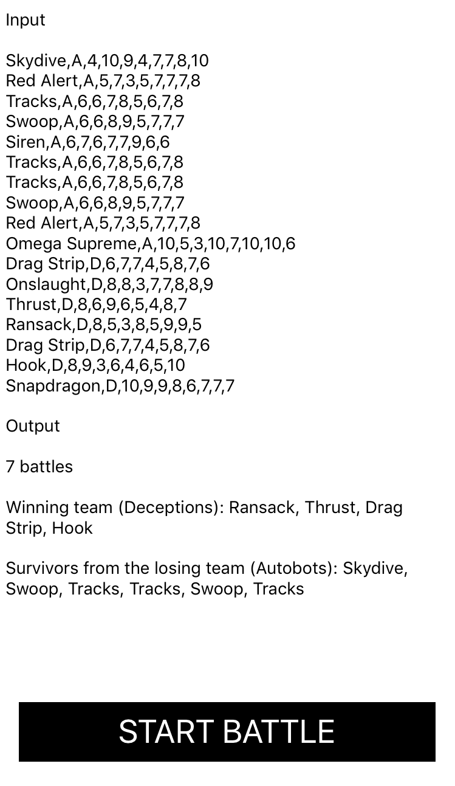

# Environment

This project is written in `Swift 4` with Xcode `Version 9.1 (9B55)`. Due to the simulator bug in this version of Xcode, Please run this project on the actual device for the best experience. 

# Run test cases 

Multiple test cases are written in `TransformationTests.swift`, use `⌘ + U` to run it. 

# Demo

I have collected some transformer profiles in `TransformerData.swift` for this test. A simple UI is also provided, press `START BATTLE` button to see same random battles :) 

